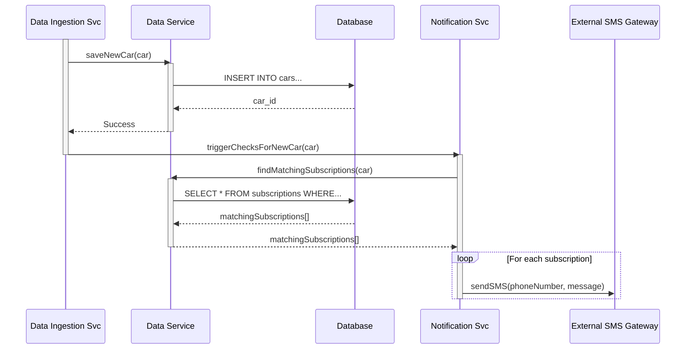

# Top 5 중고차 가격 시각화 및 알림 플랫폼 Fullstack Architecture Document

## 1. Introduction

이 문서는 백엔드 시스템, 프론트엔드 구현 및 이 둘의 통합을 포함하여 "Top 5 중고차 가격 시각화 및 알림 플랫폼"을 위한 전체 풀스택 아키텍처를 설명합니다. 이는 AI 기반 개발을 위한 단일 진실 공급원(Single Source of Truth) 역할을 하여 전체 기술 스택에서 일관성을 보장합니다.

이 통합된 접근 방식은 전통적으로 별도의 백엔드 및 프론트엔드 아키텍처 문서를 결합하여, 이러한 관심사가 점점 더 얽히는 현대적인 풀스택 애플리케이션의 개발 프로세스를 간소화합니다.

### 1.1. Starter Template or Existing Project

N/A - Greenfield project

### 1.2. Change Log

| Date | Version | Description | Author |
| :--- | :--- | :--- | :--- |
| 2025-09-28 | 1.0 | Initial architecture draft | Winston (Architect) |

---

## 2. High Level Architecture

### 2.1. Technical Summary

본 프로젝트는 **Vercel** 플랫폼을 기반으로 한 서버리스 아키텍처를 채택합니다. 프론트엔드는 **Next.js** 프레임워크를 사용하여 구현하며, 백엔드 API는 Next.js의 API Routes 기능을 활용한 **서버리스 함수**로 구축됩니다. 데이터베이스는 **Vercel Postgres**를 사용하고, 전체 코드는 **Turborepo**를 이용한 모노레포 구조로 관리됩니다. 이 아키텍처는 빠른 개발 속도, 뛰어난 성능, 그리고 트래픽에 따른 자동 확장성을 제공하여 PRD의 핵심 목표인 신속한 MVP 출시와 안정적인 서비스 운영을 효과적으로 지원합니다.

### 2.2. Platform and Infrastructure Choice

*   **Platform:** Vercel
*   **Key Services:** Next.js, Vercel Serverless Functions, Vercel Postgres, Vercel Blob
*   **Deployment Host and Regions:** Global (Vercel Edge Network)

**Rationale:** Vercel은 Next.js의 개발사로서 프레임워크에 대한 최적의 통합과 개발 경험을 제공합니다. 서버리스 함수, 데이터베이스, 스토리지 등 풀스택 애플리케이션에 필요한 모든 요소를 단일 플랫폼에서 관리할 수 있어 MVP 단계에서 인프라 복잡성을 최소화하고 개발 속도를 극대화할 수 있는 최상의 선택입니다.

### 2.3. Repository Structure

*   **Structure:** Monorepo
*   **Monorepo Tool:** Turborepo
*   **Package Organization:**
    *   `apps/web`: Next.js 애플리케이션 (프론트엔드 및 API)
    *   `packages/ui`: 공유 리액트 컴포넌트
    *   `packages/db`: 데이터베이스 스키마 및 클라이언트
    *   `packages/config`: 공유 설정 (ESLint, TypeScript 등)

**Rationale:** PRD의 기술 가정을 따라 모노레포 구조를 채택합니다. Turborepo는 Vercel 배포에 최적화되어 있으며, 프론트엔드와 백엔드 간의 코드 공유(예: 타입 정의)를 용이하게 하여 개발 효율성과 타입 안정성을 높입니다.

### 2.4. High Level Architecture Diagram

```mermaid
graph TD
    subgraph "사용자"
        A[User Browser]
    end

    subgraph "Vercel Platform"
        B[Next.js Frontend]
        C[API Routes<br>(Serverless Functions)]
        D[Vercel Postgres DB]
    end

    subgraph "외부 서비스"
        E[SMS Gateway<br>(e.g., Twilio)]
    end

    A -- HTTPS --> B
    B -- API Calls --> C
    C -- DB Queries --> D
    C -- Triggers SMS --> E
```

### 2.5. Architectural Patterns

*   **Jamstack Architecture:** 정적 사이트 생성(SSG)과 서버리스 API를 결합한 구조입니다. - _Rationale:_ 초기 로딩 속도를 극대화하고, CDN을 통해 전 세계 사용자에게 빠르고 안정적인 서비스를 제공합니다.
*   **Serverless Functions:** 백엔드 로직을 독립적인 서버리스 함수로 구현합니다. - _Rationale:_ 사용량에 따라 자동으로 확장/축소되어 비용 효율적이며, 서버 관리가 필요 없어 개발팀이 비즈니스 로직에 집중할 수 있습니다.
*   **Component-Based UI:** UI를 재사용 가능한 독립적인 컴포넌트 단위로 개발합니다. - _Rationale:_ PRD에서 제안된 React/Vue 기반으로, 코드의 재사용성을 높이고 유지보수를 용이하게 합니다.
*   **Repository Pattern:** 데이터베이스 접근 로직을 추상화하여 분리합니다. - _Rationale:_ 비즈니스 로직과 데이터베이스 간의 의존성을 낮춰, 향후 데이터베이스 변경이나 단위 테스트 작성 시 유연성을 확보합니다.

---

## 3. Tech Stack

| Category | Technology | Version | Purpose | Rationale |
| :--- | :--- | :--- | :--- | :--- |
| **Frontend Language** | TypeScript | ~5.x | 타입 안정성 확보 | 컴파일 시점 에러 감지를 통해 코드 안정성 및 유지보수성 향상 |
| **Frontend Framework** | Next.js | ~14.x | 풀스택 웹 애플리케이션 구축 | 서버리스 API, 최적화된 렌더링 등 풀스택 개발에 필요한 기능을 내장 |
| **UI Component Library** | shadcn/ui | latest | UI 컴포넌트 기반 제공 | 접근성을 갖춘 고품질 컴포넌트를 제공하여 UI 개발 속도 향상 |
| **State Management** | Zustand | ~4.x | 클라이언트 상태 관리 | 가볍고 간단한 API를 제공하여 최소한의 보일러플레이트로 상태 관리 가능 |
| **Backend Language**| TypeScript | ~5.x | 프론트엔드와 언어 통일 | 모노레포 내에서 타입 공유 및 일관된 개발 경험 제공 |
| **Backend Framework**| Next.js API Routes | ~14.x | 서버리스 백엔드 API 구축 | 프론트엔드와 동일한 프로젝트 내에서 API를 관리하여 개발 간소화 |
| **API Style** | REST | N/A | 클라이언트-서버 통신 | 가장 널리 사용되는 표준적인 API 스타일 |
| **Database** | Vercel Postgres | latest | 데이터 영구 저장 | Vercel 플랫폼에 완벽하게 통합되어 별도 설정 없이 사용 가능 |
| **Authentication** | NextAuth.js | ~5.x | 사용자 인증 처리 | 다양한 인증 방식(소셜, 이메일)을 쉽게 통합할 수 있는 표준 라이브러리 |
| **Frontend Testing**| Vitest + RTL | latest | 컴포넌트 및 유닛 테스트 | 빠르고 설정이 간편하며, 실제 사용자 동작과 유사한 테스트 작성 가능 |
| **Backend Testing**| Vitest | latest | API 및 비즈니스 로직 테스트 | 프론트엔드와 동일한 테스트 러너를 사용하여 개발 경험 통일 |
| **E2E Testing** | Playwright | ~1.x | End-to-End 통합 테스트 | 실제 브라우저 환경에서 사용자 시나리오를 안정적으로 테스트 |
| **Build Tool** | Turborepo | ~1.x | 모노레포 빌드 시스템 | 모노레포 환경에서 효율적인 빌드 및 캐싱을 통해 CI/CD 속도 향상 |
| **CI/CD** | GitHub Actions | N/A | 지속적 통합 및 배포 | Vercel과의 자동 통합을 통해 Git push 시 자동으로 빌드 및 배포 실행 |
| **Monitoring** | Vercel Analytics | N/A | 사용자 및 성능 모니터링 | 별도 설정 없이 Core Web Vitals 등 핵심 성능 지표를 수집 |
| **CSS Framework** | Tailwind CSS | ~3.x | 유틸리티 우선 CSS 스타일링 | 빠르고 일관된 UI 개발을 지원하며, shadcn/ui의 기반 기술 |

---

## 4. Data Models

### 4.1. User
**Purpose:** 사용자 계정 정보, 로그인 자격 증명, 그리고 알림을 위한 연락처 정보를 저장합니다.
**TypeScript Interface:**
```typescript
export interface User {
  id: string;
  email: string;
  phoneNumber: string | null;
  createdAt: Date;
  updatedAt: Date;
}
```
**Relationships:**
*   한 명의 사용자는 여러 개의 `AlertSubscription` (알림 구독)을 가질 수 있습니다. (One-to-Many)

### 4.2. Car
**Purpose:** 개별 중고차 매물의 사양, 가격, 판매 상태 등 모든 관련 정보를 저장합니다.
**TypeScript Interface:**
```typescript
export type CarStatus = 'FOR_SALE' | 'SOLD';

export interface Car {
  id: string;
  modelName: string;
  price: number;
  mileage: number;
  hasAccident: boolean;
  status: CarStatus;
  listedAt: Date;
  soldAt: Date | null;
  createdAt: Date;
  updatedAt: Date;
}
```
**Relationships:**
*   이 모델은 다른 모델과 직접적인 관계를 갖지 않습니다.

### 4.3. AlertSubscription
**Purpose:** 새로운 차량 매물에 대한 SMS 알림을 받기 위해 사용자가 저장한 검색 조건을 저장합니다.
**TypeScript Interface:**
```typescript
export interface AlertSubscription {
  id: string;
  userId: string;
  modelName: string;
  maxPrice?: number;
  maxMileage?: number;
  allowAccidents: boolean;
  isActive: boolean;
  createdAt: Date;
  updatedAt: Date;
}
```
**Relationships:**
*   하나의 `AlertSubscription`은 반드시 하나의 `User`에 속합니다. (Many-to-One)

---

## 5. API Specification

```yaml
openapi: 3.0.0
info:
  title: "중고차 시각화 및 알림 플랫폼 API"
  version: "1.0.0"
  description: "차량 데이터 조회 및 알림 구독 관리를 위한 API 명세"
servers:
  - url: "/api"
    description: "Local development server"
paths:
  /cars/{modelName}:
    get:
      summary: "특정 모델의 차량 목록 조회"
      parameters:
        - name: modelName
          in: path
          required: true
          schema: { type: string }
      responses:
        '200':
          description: "성공"
          content:
            application/json:
              schema:
                type: array
                items: { $ref: '#/components/schemas/Car' }
  /subscriptions:
    get:
      summary: "사용자의 알림 구독 목록 조회"
      security: [ { cookieAuth: [] } ]
      responses:
        '200':
          description: "성공"
          content:
            application/json:
              schema:
                type: array
                items: { $ref: '#/components/schemas/AlertSubscription' }
    post:
      summary: "새 알림 구독 추가"
      security: [ { cookieAuth: [] } ]
      requestBody:
        content:
          application/json:
            schema: { $ref: '#/components/schemas/CreateSubscriptionInput' }
      responses:
        '201':
          description: "성공적으로 생성됨"
components:
  securitySchemes:
    cookieAuth: { type: apiKey, in: cookie, name: next-auth.session-token }
  schemas:
    Car:
      type: object
      properties: { id: { type: string }, modelName: { type: string }, price: { type: number } }
    AlertSubscription:
      type: object
      properties: { id: { type: string }, modelName: { type: string }, maxPrice: { type: number } }
    CreateSubscriptionInput:
      type: object
      properties: { modelName: { type: string }, maxPrice: { type: number } }
```

---

## 6. Components

### 6.1. Component List

#### Web UI (Next.js App)
*   **Responsibility:** 사용자에게 UI를 렌더링하고, 사용자 입력을 처리하며, 백엔드 API와 통신하여 데이터를 표시합니다.
*   **Dependencies:** API Service
*   **Technology Stack:** Next.js, React, TypeScript, Tailwind CSS, Zustand

#### API Service (Next.js API Routes)
*   **Responsibility:** Web UI로부터의 HTTP 요청을 받아들이고, 비즈니스 로직을 실행하며, 데이터를 처리합니다.
*   **Dependencies:** Data Service, Authentication Service, Notification Service
*   **Technology Stack:** Next.js API Routes, TypeScript

#### Data Service (Repository)
*   **Responsibility:** 데이터베이스에 대한 모든 접근(CRUD)을 추상화하고 캡슐화합니다.
*   **Dependencies:** Vercel Postgres
*   **Technology Stack:** `@vercel/postgres` SDK, TypeScript

#### Authentication Service (NextAuth.js)
*   **Responsibility:** 사용자 인증 및 권한 부여 로직을 처리합니다.
*   **Dependencies:** Data Service
*   **Technology Stack:** NextAuth.js, TypeScript

#### Notification Service
*   **Responsibility:** 조건에 맞는 사용자에게 SMS 알림을 발송하는 프로세스를 담당합니다.
*   **Dependencies:** Data Service, External SMS Gateway
*   **Technology Stack:** TypeScript, Twilio SDK

#### Data Ingestion Service
*   **Responsibility:** 외부 소스로부터 중고차 데이터를 주기적으로 가져와 데이터베이스에 저장합니다.
*   **Dependencies:** Data Service
*   **Technology Stack:** TypeScript, CSV Parser

### 6.2. Component Diagram

```mermaid
componentDiagram
    actor User as "사용자"
    package "우리 시스템" {
        participant "Web UI" as WebUI
        participant "API Service" as APIService
        participant "Data Service" as DataService
        database "Database" as DB
        participant "Auth Service" as AuthService
        participant "Notification Svc" as NotificationSvc
        participant "Data Ingestion Svc" as IngestionSvc
    }
    actor "External SMS Gateway" as SMSGateway
    User -->> WebUI : 상호작용
    WebUI -->> APIService : HTTP API 호출
    APIService -->> DataService : 데이터 요청
    APIService -->> AuthService : 인증 요청
    APIService -->> NotificationSvc : 알림 트리거
    AuthService -->> DataService : 사용자 정보 조회
    NotificationSvc -->> DataService : 구독 정보 조회
    NotificationSvc -->> SMSGateway : SMS 발송 요청
    IngestionSvc -->> DataService : 데이터 쓰기
    DataService -->> DB : 데이터 읽기/쓰기
```

---

## 7. External APIs

### Twilio API
*   **Purpose:** 사용자에게 '구매 희망 범위'에 맞는 신규 매물 알림을 SMS로 발송하기 위해 사용합니다.
*   **Documentation:** `https://www.twilio.com/docs/sms/api`
*   **Authentication:** API Key and Account SID
*   **Key Endpoints Used:** `POST /2010-04-01/Accounts/{AccountSid}/Messages.json`

---

## 8. Core Workflows



---

## 9. Database Schema

```sql
CREATE EXTENSION IF NOT EXISTS "citext";
CREATE TYPE car_status AS ENUM ('FOR_SALE', 'SOLD');

CREATE TABLE "users" (
  "id" uuid PRIMARY KEY DEFAULT gen_random_uuid(),
  "email" citext UNIQUE NOT NULL,
  "password_hash" text NOT NULL,
  "phone_number" text,
  "created_at" timestamptz NOT NULL DEFAULT now(),
  "updated_at" timestamptz NOT NULL DEFAULT now()
);

CREATE TABLE "cars" (
  "id" uuid PRIMARY KEY DEFAULT gen_random_uuid(),
  "model_name" text NOT NULL,
  "price" integer NOT NULL,
  "mileage" integer NOT NULL,
  "has_accident" boolean NOT NULL DEFAULT false,
  "status" car_status NOT NULL DEFAULT 'FOR_SALE',
  "listed_at" timestamptz NOT NULL,
  "sold_at" timestamptz,
  "created_at" timestamptz NOT NULL DEFAULT now(),
  "updated_at" timestamptz NOT NULL DEFAULT now()
);

CREATE TABLE "alert_subscriptions" (
  "id" uuid PRIMARY KEY DEFAULT gen_random_uuid(),
  "user_id" uuid NOT NULL REFERENCES "users"("id") ON DELETE CASCADE,
  "model_name" text NOT NULL,
  "max_price" integer,
  "max_mileage" integer,
  "allow_accidents" boolean NOT NULL DEFAULT true,
  "is_active" boolean NOT NULL DEFAULT true,
  "created_at" timestamptz NOT NULL DEFAULT now(),
  "updated_at" timestamptz NOT NULL DEFAULT now()
);

CREATE INDEX "idx_cars_model_name_status" ON "cars" ("model_name", "status");
CREATE INDEX "idx_alert_subscriptions_user_id" ON "alert_subscriptions" ("user_id");
CREATE INDEX "idx_alert_subscriptions_matching" ON "alert_subscriptions" ("is_active", "model_name");
```

---

## 10. Unified Project Structure

```plaintext
/
├── apps
│   └── web/                # Next.js App (Frontend + API)
│       ├── src/
│       │   ├── app/
│       │   │   ├── (api)/      # API Routes
│       │   │   └── (app)/      # UI Pages & Components
│       │   └── lib/          # Helper functions, DB client
│       └── package.json
├── packages
│   ├── db/                 # Database schema, types, repository
│   ├── ui/                 # Shared React components (shadcn/ui)
│   └── config/             # Shared configs (ESLint, TSConfig)
├── .env.example
├── package.json
└── turborepo.json
```

---

## 11. Development Workflow

### Local Development Setup
1.  **Prerequisites:** Node.js >= 18.x, npm/yarn/pnpm
2.  **Initial Setup:**
    ```bash
    npm install
    cp .env.example .env
    # Fill in .env with database and auth credentials
    ```
3.  **Development Commands:**
    ```bash
    # Start all services
    npm run dev

    # Run tests
    npm run test
    ```

---

## 12. Deployment Architecture

*   **Deployment Strategy:** Main branch is continuously deployed to Production on Vercel. Pull Requests are deployed to unique Preview URLs.
*   **CI/CD Pipeline:** A simple GitHub Actions workflow will run on every PR to execute linting and tests. Vercel handles the deployment automatically upon merge to main.
*   **Environments:**
    *   **Development:** Local machine (`localhost`)
    *   **Staging:** Vercel Preview Deployments (`*-project.vercel.app`)
    *   **Production:** Vercel Production Deployment (Custom Domain)

---

## 13. Testing Strategy

*   **Unit Tests:** Vitest will be used to test individual functions, React components, and API logic in isolation. Located alongside the source files (`*.test.ts`).
*   **Integration Tests:** Vitest will also be used to test interactions between components, such as an API route calling the Data Service.
*   **E2E Tests:** Playwright will be used to test critical user flows from end-to-end in a real browser environment. (e.g., Login -> Set Alert -> Verify).

---

## 14. Coding Standards

*   **Type Sharing:** All database types and API request/response types must be defined in `packages/db` and imported into the `apps/web` application. There should be no duplicate type definitions.
*   **Environment Variables:** Never access `process.env` directly in components or API routes. Use a centralized config object to expose environment variables to the application.
*   **Naming Conventions:**
    *   Components: `PascalCase.tsx`
    *   API Routes: `kebab-case/route.ts`
    -   Database Tables: `snake_case`

---

## 15. Checklist Results
(To be run after document approval)
