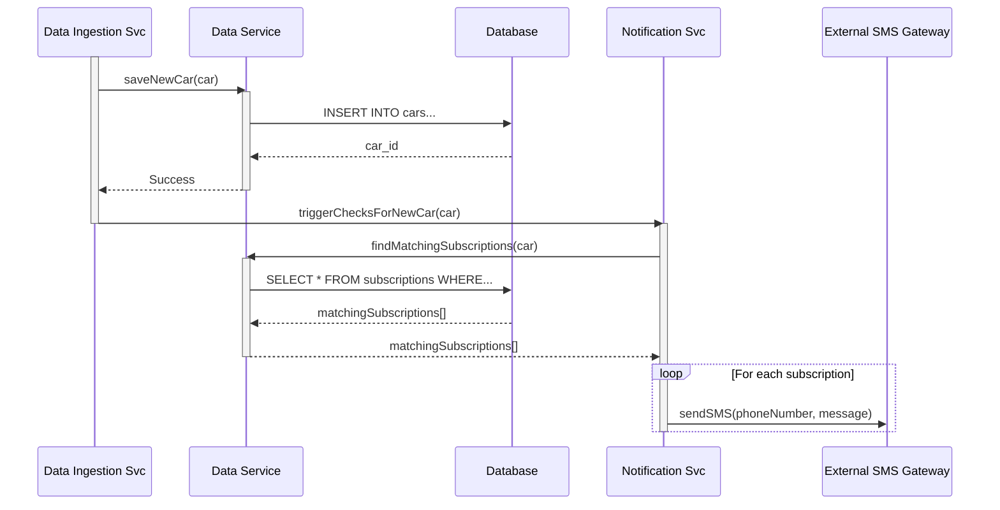

# 8. Core Workflows

```mermaid
sequenceDiagram
    participant IngestionSvc as Data Ingestion Svc
    participant DataService as Data Service
    participant DB as Database
    participant NotificationSvc as Notification Svc
    participant SMSGateway as External SMS Gateway
    activate IngestionSvc
    IngestionSvc->>DataService: saveNewCar(car)
    activate DataService
    DataService->>DB: INSERT INTO cars...
    DB-->>DataService: car_id
    DataService-->>IngestionSvc: Success
    deactivate DataService
    IngestionSvc->>NotificationSvc: triggerChecksForNewCar(car)
    deactivate IngestionSvc
    activate NotificationSvc
    NotificationSvc->>DataService: findMatchingSubscriptions(car)
    activate DataService
    DataService->>DB: SELECT * FROM subscriptions WHERE...
    DB-->>DataService: matchingSubscriptions[]
    DataService-->>NotificationSvc: matchingSubscriptions[]
    deactivate DataService
    loop For each subscription
        NotificationSvc->>SMSGateway: sendSMS(phoneNumber, message)
    end
    deactivate NotificationSvc
```

---
